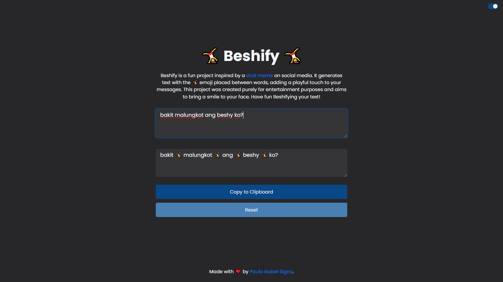

# Beshify 🤸

 

Beshify is a fun project inspired by a [viral meme](https://www.youtube.com/watch?v=F0cqLhz2lzE) on social media. It generates text with the 🤸 emoji placed between words, adding a playful touch to your messages. This project was created purely for entertainment purposes and aims to bring a smile to your face. Have fun Beshifying your text!

## Built with
- HTML5
- Bootstrap
- JavaScript

## Features

- Light/dark mode toggle
- Copy to clipboard
- Reset functionality
- Responsive design
- User-friendly interface

## Author

- [@paulaxisabel](https://www.github.com/paulaxisabel)